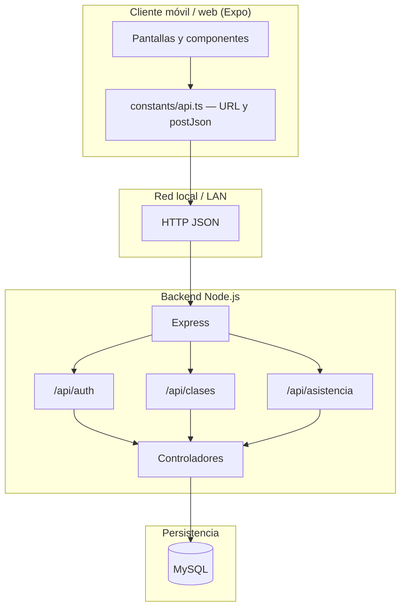
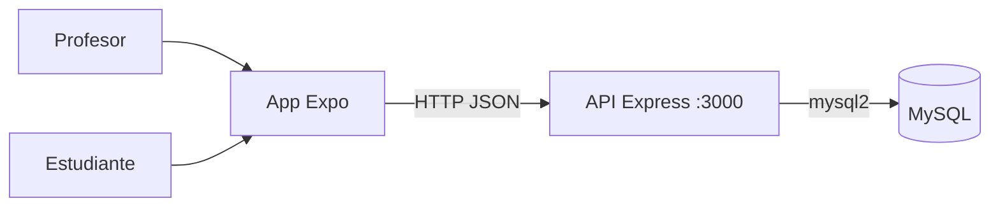
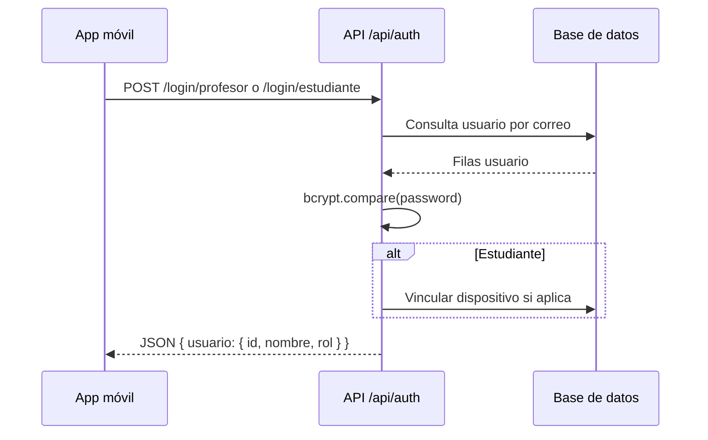
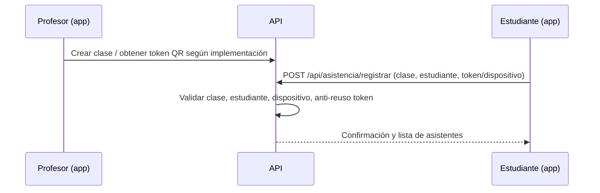

# Arquitectura

## Vista de capas

## Actores y sistemas

## Flujo de autenticación (resumen)

## Flujo de asistencia por QR

## Estructura de carpetas (resumen)

| Ruta | Rol |
|------|-----|
| `Mobile/app/` | Entrada Expo Router (`index.tsx` — selección de rol) |
| `Mobile/components/` | Vistas: login, profesor, estudiante, detalle clase, registro |
| `Mobile/constants/api.ts` | Resolución de `API_URL` y `postJson` |
| `Mobile/utils/` | IDs de dispositivo, QR, exportación Excel (según rama) |
| `server/src/index.js` | App Express, conexión DB, rutas |
| `server/src/routes/` | Definición de rutas REST |
| `server/src/controllers/` | Lógica de negocio |

## Decisiones de diseño

1. **API bajo `/api`** para separar del health check `/`.
2. **CORS habilitado** para desarrollo con Expo en distintos hosts.
3. **Helmet** para cabeceras HTTP de seguridad básicas.
4. **Vínculo de dispositivo** en login de estudiante para reducir uso de cuentas en varios móviles (lógica en `authController` + `deviceId.ts`).
5. **URL del API en cliente**: prioridad `EXPO_PUBLIC_API_URL` → web `localhost` → IP de Metro (`hostUri`) → emulador Android `10.0.2.2`.

## Ver también

- [[Instalacion]]
- [[API REST]]
- [[Modelo de datos]]
