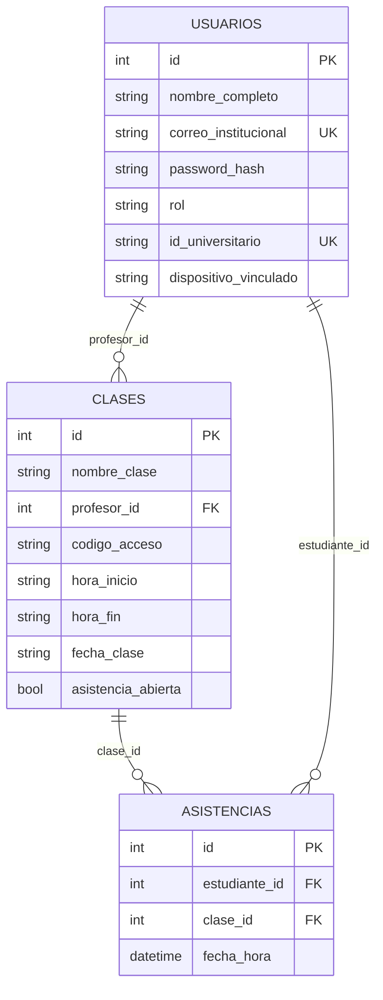

# Modelo de datos

El proyecto incluye scripts SQL en la raíz de `server/` (por ejemplo `database_schema.sql` para MySQL). Las tablas evolucionan con **migraciones aplicadas al arranque** en `server/src/index.js` (columnas extra en `clases`, tabla `tokens_qr_usados`, `dispositivo_vinculado` en `usuarios`, etc.).

## Diagrama entidad-relación (conceptual)

## Tabla auxiliar (anti-reuso QR)

- **`tokens_qr_usados`**: almacena nonces de uso único del QR según la lógica del `asistenciaController`, con limpieza periódica.

## Notas

- Los tipos exactos (`INT`, `VARCHAR`, etc.) dependen del script SQL aplicado.
- El **vínculo de dispositivo** en estudiantes usa `usuarios.dispositivo_vinculado` y los IDs enviados desde la app (`deviceId`).

## Ver también

- [[API REST]]
- [[Arquitectura]]
